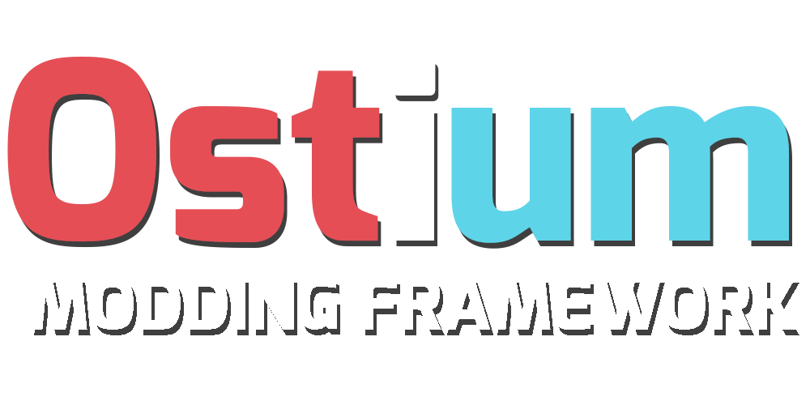

<p align="center">
  <a href="" rel="noopener">
 </a>
</p>

<div align="center">

[](https://discord.gg/R9UHJ4M9QW)
[](/LICENSE)

</div>

---

<p align="center"> OST is a modding framework for Splitgate that allows offline play, online private matches and asset modding.
    <br> 
</p>

## 📝 Table of Contents

- [About](#about)
- [Getting Started](#getting_started)
- [Authors](#authors)
- [Acknowledgments](#acknowledgement)

## 🧐 About <a name = "about"></a>

Ostium is a private Splitgate server, this allows our users to play against bots or against their friends while the servers are down or right after an update! Using Ostium you don't gain any levels or progress on the Splitgate servers as we're using our server software which is completely detached from the Splitgate servers.

Doing this it allows us to implement other features such as a modding framework and cosmetic support, we also wish to support custom asset streaming which would allow users to create their own weapon and character skins and view/use them with Ostium.

## 🏁 Getting Started <a name = "getting_started"></a>

These instructions will get Ostium working on your computer, if you have any problems please do not hesitate to join [our discord](https://discord.gg/R9UHJ4M9QW) and ask for help!

### Prerequisites

What things you need to install the software and how to install them.

```
[Prerequisites]
```

### Installing

A step by step series of examples that tell you how to get the launcher working!

Download prerequisites and launcher.

```
```

TODO: Steps of install

TODO: Example of installed launcher and how it works

## ✍️ Authors <a name = "authors"></a>

- [@AquaPlaysYT](https://github.com/AquaPlaysYT) - Initial Ideas and Developer
- [@PsychoPast](https://github.com/PsychoPast) - Developer
- [@ItsSyfe](https://github.com/ItsSyfe) - Developer
- [@Androidy](https://github.com/SiLeNSwOrD) - Developer

See also the list of [contributors](https://github.com/OstiumDev/Ostium/contributors) who participated in this project.

## 🎉 Acknowledgements <a name = "acknowledgement"></a>

- N/A